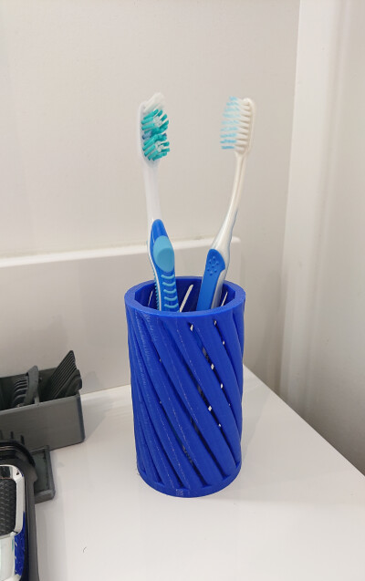
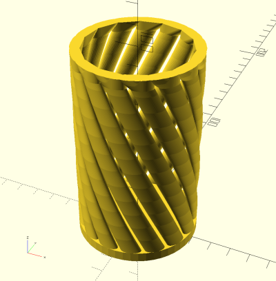

# 3D Parametric Spiral Cup (06/2019)

<table>
<tr>
<td></td>
<td></td>
</tr>
</table>

A parametric spiral cup that can be used as a toothbrush holder, a pen/pencil holder, etc. Made in OpenSCAD.

**Design:** [spiral_cup.scad](spiral_cup.scad) (OpenSCAD)

**STLs:** [spiral_cup.stl](stls/spiral_cup.stl)

**Recommended Print Settings:** 0.30mm layer height, 20% infill, no supports

**Thingiverse:** https://www.thingiverse.com/thing:3714080

**License**: 
